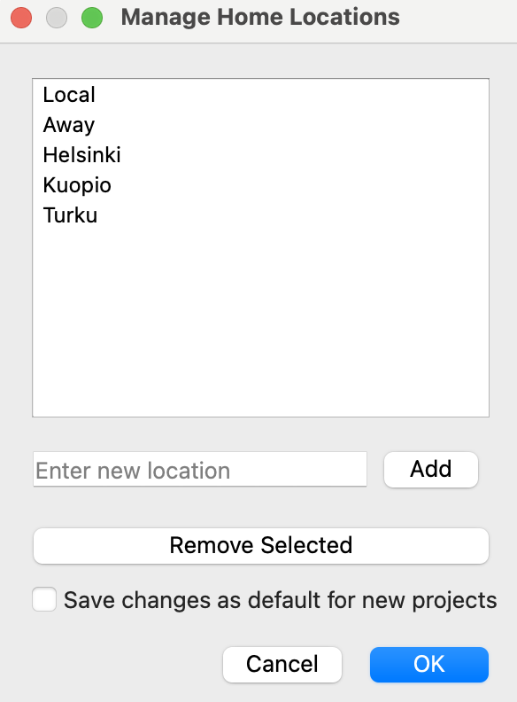
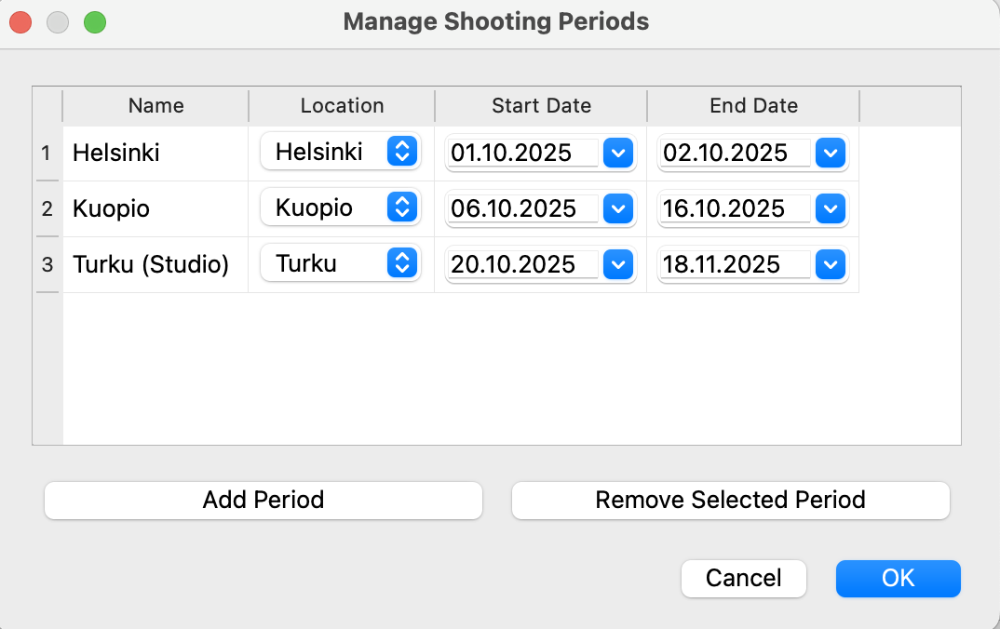
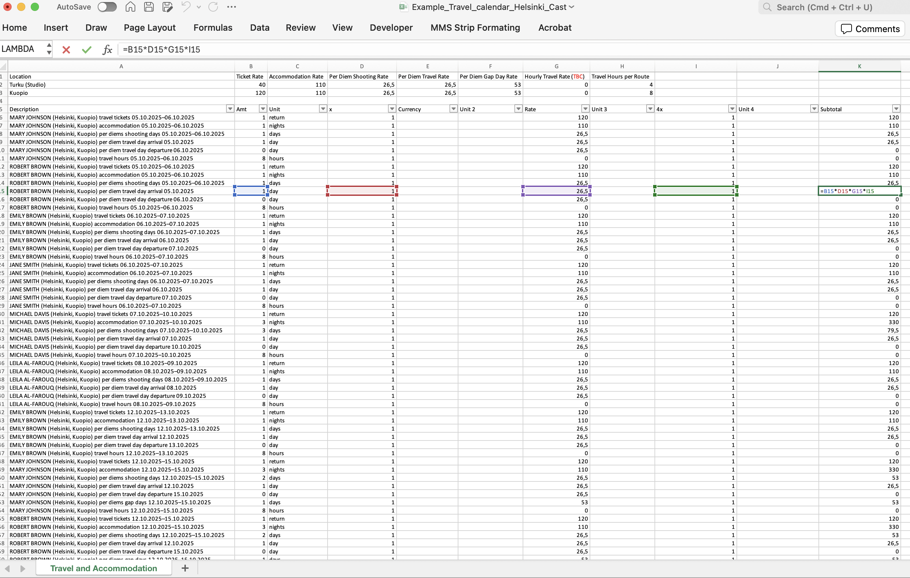
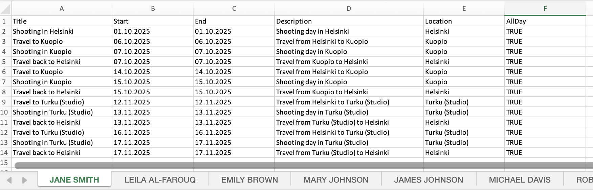

# Cast Travel and Accommodation Calculator

*Note: This code and the readme.md file were created with ChatGPT (version o1-preview or o1-mini). I don’t have prior coding knowledge, and the same bot guided me through navigating GitHub. However, the code appears to work for my purposes.*

*If you decide to use the application now, it is still recommended to verify the calculations yourself. The major tests have not been completed yet, but based on smaller experiments, the calculations appear to be accurate.*

## Overview
An application to calculate travel and accommodation needs and budget for cast members based on shooting schedules.


## Features

-	Load and process cast schedules from Excel files.
-	Manage home locations and shooting periods.
-	Calculate travel and accommodation needs based on user-defined logic.
-	Export results and calendars to Excel files.
-	User-friendly GUI built with PyQt5.

## Example Images










## Prerequisites

- Python 3.6 or higher
- Git (optional, for cloning the repository)

## Installation

It’s recommended to use a virtual environment to manage dependencies.

**Step 1: Clone the Repository (Optional)**

   ```bash
   git clone https://github.com/joonaskaup/cast-travel-calculator.git
   cd cast-travel-calculator
   ```

**Step 2: Create a Virtual Environment**

**On Windows**
   ```bash
   python -m venv venv
   venv\Scripts\activate
   ```

**On macOS and Linux**
   ```bash
   python3 -m venv venv
   source venv/bin/activate
   ```

**Step 3: Install Dependencies**

   ```bash
   pip install -r requirements.txt
   ```
**Usage**

1.	**Run the Application**

Run the following command:
   ```bash
   python travel_day_calc_v1_1.py
   ```
2.	**Create a New Project**
- Go to **File > New Project**.
- Select the cast schedule Excel file when prompted.
- Enter a project name.

3.	**Manage Home Locations and Shooting Periods**
- Use the **Manage Home Locations** button to add or remove locations.
- Use the **Manage Shooting Periods** button to define shooting periods and locations.

4.	**Set Logic Parameters**
- Adjust the **maximum gap days**, **weekend policy**, and **arrival/departure** options as needed.
	
5. **Select Cast Members**
- Include or exclude cast members using the checkboxes.
- Set the home location for each cast member.
	
6.	**Apply Logic and Export**
- Click **Apply Logic** to calculate travel and accommodation needs.
- Use **Export to Excel** to save the results as a budget
- Use **Export Calendar** to generate a calendar of events.
- Include detailed rates and hours information for travel and accommodation in the exported Excel file to facilitate budget calculations

7. **Using the Example Project**

To help you get started quickly, an example project is included in the examples folder. It contains:
- An example cast schedule Excel file (Example_Cast.xlsx).
- An example project JSON file (Example_Project.json).

Steps to Use the Example Project:

1. **Open the Example Project:**

- Go to **File > Open Project**.
- Select **Example_Project.json** and open it.

2. **Explore the Project:**

- The application will load the example data.
- You can see how cast members, home locations, and shooting periods are set up.
- Experiment with the logic parameters and see how the outputs change.
- Use this as a reference to understand how to set up your own projects.

**License**

This project is licensed under the MIT License.

**PyQt5 License Notice:**

PyQt5 is licensed under the Riverbank Commercial License and the GNU GPL v3. Please ensure compliance with PyQt5’s licensing terms when distributing applications that use PyQt5.

**Acknowledgments**

- PyQt5: Used for building the GUI.
- Pandas: Used for data processing.
- OpenPyXL: Used for Excel file handling.